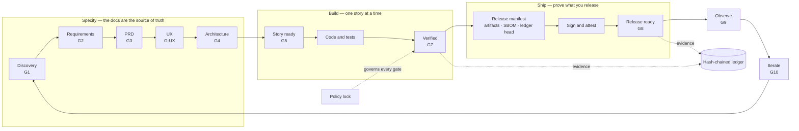

<div align="center">

# EOS — Engineering Operating System

**Evidence-gated delivery for AI-assisted teams — offline-first, zero dependencies, from idea to signed release.**

[](https://github.com/niaodian/eos/releases/latest)
[](https://github.com/niaodian/eos/actions/workflows/eos-ci.yml)
[](.github/workflows/eos-ci.yml)
[](https://github.com/niaodian/eos/attestations)
[](package.json)
[](package.json)
[](LICENSE)

English · [简体中文](README.zh.md)

</div>

AI assistants now write code faster than any team can review it. EOS keeps that speed honest. Every
stage of delivery — problem, requirements, design, architecture, stories, code, release — passes a
machine-checked gate; every verdict is bound to the exact commit it judged; every release can prove
what it contains and where it was built. It runs entirely on your machine — with GitHub Copilot in VS Code,
Claude Code, OpenAI Codex or Google Antigravity, or from any terminal — with no services, no accounts and
no dependencies.

## Why EOS

| The problem | What EOS does about it |
|---|---|
| **AI code slop** — plausible code with no spec and no tests, merged because it looked right | Work moves forward only on evidence. Gates run your real test commands on the commit and record the verdict with every input hash. Missing or stale evidence is refused; a missing tool is BLOCKED and a crashed one is ERROR — never PASS. |
| **Invisible governance decay** — a gate quietly loosened, a prompt that cites a rule that no longer exists | The policy is locked: weakening any gate needs a written reason and a second person, or CI fails. The prompts and agents your AI reads may only cite gates, commands and transitions that really exist. |
| **Supply-chain tampering** — a release that is not what was reviewed | A release manifest binds the artifacts, the SBOM and the ledger head. It can be signed with Ed25519 and bound to GitHub artifact attestations or SLSA provenance, and both are verified offline. |

One engine, two tracks: a startup gets frictionless defaults, a regulated team turns the same checks
into hard requirements. No fork, no second tool, no migration when you grow into it.

## What makes it different

- **Offline-first by construction.** EOS Core never touches the network: every check, gate and
  verification runs locally on Node alone. The only ways out are explicit and opt-in — `eos policy sync`
  fetches a central baseline, and providers you declare ask GitHub, through your own `gh` login, what a
  laptop cannot know. Tests enforce that boundary.
- **A tamper-evident ledger.** Promotions are events in an append-only, hash-chained log that survives
  branches and merges. `eos ledger --verify` proves nothing was rewritten.
- **Policy locks.** `.eos/policy.lock.json` pins every gate and workflow rule. A weakening without a
  reasoned, approved lock fails CI, and an organisation can distribute a signed baseline that every
  repository enforces locally.
- **No prompt-to-gate drift.** The instructions your AI follows are checked against the machine policy,
  so a prompt can never promise a gate, command or transition that does not exist.
- **Evidence you can audit.** Each verdict records the commit, the gate version and the input hashes.
  `eos report` turns the ledger into a governance report for one repository or a whole organisation.
- **Works in the agent you already use.** The workflows, the guardrail and an MCP server are written once
  and generated for each agent: GitHub Copilot, Claude Code and Google Antigravity out of the box; OpenAI
  Codex, Cursor and Gemini CLI with one command. In every agent, approving, waiving and promoting work
  remain commands a person runs.
- **Any stack, both paradigms.** Node, Python, Go, Java, Rust and .NET; deterministic SaaS and
  probabilistic LLM or agentic products with eval-driven gates — kept explicitly isolated.

## Two tracks, one engine

|  | **Standard** (default) | **Regulated** |
|---|---|---|
| Built for | open source, startups, internal products | finance, health, public sector, audited software |
| Choose it | `eos init <pack>` | `eos init <pack> --track regulated` |
| Cost to adopt | none — no keys, no secrets, no services | one release signing key and CI-produced evidence |
| Gates and evidence | every SDLC gate; evidence may be recorded locally | the same gates; release evidence must come from CI |
| Signed release manifest | verified when present, never required | required — unsigned or tampered blocks the release |
| Build provenance | GitHub artifact attestations, verified when present | required for every artifact; SLSA Build Level 3 generator |
| Weakening a gate | needs a written reason and a second person | the same, plus an optional central baseline (`eos policy sync`) |
| Missing signature at release | NOT_APPLICABLE, with the command that adds it | FAIL — the release is blocked |

Switching later is one command. Moving down to Standard is itself a policy weakening, so `eos next`
shows it with the exact `eos policy lock --write --reason "<why>"` that acknowledges it.

## Quickstart

You need Node.js 20.10+ (22 or 24 recommended — Node 20 reached end of life on 2026-04-30) and Git. An
AI agent is optional — the CLI works in any terminal.

```bash
# 1. Start from a pinned release and make it your repository
npx degit niaodian/eos#eos-2.4.0 my-app && cd my-app && git init

# 2. Declare the project — no code yet, so the stack is decided at architecture time
npx --offline eos init config-only --write        # add --track regulated for the strict track
git add -A && git commit -m "chore: start from eos"   # the declaration, with its own policy lock and SBOM

# 3. Ask for the one next step: what to do, why, and how to start it
npx --offline eos next

# 4. The daily loop
npx --offline eos status                          # where the work stands, and on which track
npx --offline eos check --gate discovery-ready    # run one gate and record its evidence
npx --offline eos verify                          # re-run every gate your change can affect
```

- **The `npx --offline eos` shortcut needs npm 10.9+** (bundled with Node 22). On older npm, use
  `npm run -s eos -- <command>` or `node .github/eos/eos.mjs <command>` — they are identical. Keep
  `--offline`: the public registry has an unrelated package called `eos`, and the flag guarantees that
  only this checkout ever runs.
- **Already have code?** `npx --offline eos init` lists the starter packs (`node-service`,
  `python-service`, `go-service`, `java-service`, `rag-app`, `agentic-app`, `data-pipeline`, `library`,
  `regulated-app`) and names the ones that match the code it finds.
- **Green from the first push.** `eos init --write` replaces the template's declaration with yours and
  starts your own policy lock and SBOM — the template's described EOS
  ([ADR-022](docs/adr/022-first-declaration-starts-the-policy.md)). CI then runs the governance gate on your
  project, not EOS's own test suite ([ADR-021](docs/adr/021-eos-tests-run-only-in-eos.md)).
- **In your agent** the same loop is one slash command away. The one-time setup for each agent is in the
  [user manual, Chapter 6.6](docs/eos/user-manual.md#chapter-66-using-eos-with-claude-code-codex-and-antigravity):
  - **GitHub Copilot (VS Code):** the **eos-guide** agent, or `/eos-next` · `/eos-resume` · `/eos-status`.
    Open the project folder itself as the workspace root, or the agents stay inactive.
  - **Claude Code:** run `claude` in the project folder, approve the `eos` MCP server once, then `/eos-next`.
  - **OpenAI Codex:** run `npx --offline eos agents sync --platform codex --write` once and commit it, trust
    the project, approve the guardrail with `/hooks`, then `$eos-next`.
  - **Google Antigravity:** open the folder, then `/eos-next`, or pick a stage agent such as `eos-architecture`.

## How it works



- **Gates** — every stage has one (`eos explain <gate>` prints its rules). A gate runs real checks —
  your test commands, spec alignment, schemas — and writes evidence bound to the commit, the gate
  version and every input hash.
- **Transitions** — `eos transition` refuses illegal jumps, missing approvals and stale evidence, and an
  approval must come from a second person, never the requester.
- **The ledger** — every promotion is an event in an append-only, hash-chained log that merges cleanly
  across branches.
- **Releases** — `eos release bind` pins the artifacts, the SBOM and the ledger head into a manifest;
  `eos release sign` signs it; CI attests the build; `eos verify-release` checks all of it on the
  candidate commit.

## Commands at a glance

| Command | What it does |
|---|---|
| `eos next` | the one recommended next action — what, why and how to start it |
| `eos status` | where the product, the active story and the release stand, and the governance track |
| `eos check --gate <id>` | run one gate for real and record its evidence |
| `eos verify` | re-run the gates your change can have affected (`--full` for all of them) |
| `eos transition` · `eos approve` | move work forward — refused without evidence or a second approver |
| `eos release bind` · `sign` · `verify` | bind artifacts, SBOM and ledger head; sign; verify signature and provenance |
| `eos verify-release --release <id>` | the release gate, re-run on the candidate commit |
| `eos policy check` · `lock` · `sync` | detect, approve and distribute governance changes |
| `eos report --format markdown` | a governance report: gates, waivers, evidence, SBOM and signatures |
| `eos health` · `eos doctor` | one-screen project health; whether EOS itself is wired correctly |
| `eos upgrade --from <new> --base <old>` | move to a new EOS version — three-way per file, never overwrites your edits |
| `eos agents sync --platform <name>` | generate what an agent reads: the skills, the `eos` MCP entry, the guardrail hook and the stage agents |
| `eos mcp` | the read and verify commands as MCP tools for your agent; approving and waiving stay CLI commands |
| `eos init <pack> --brownfield` | adopt EOS in a system that already runs, at the delivery gates |
| `eos stage init <stage>` | a stage record's skeleton from its schema; no gate passes until every answer is given |

Add `--json` for machine-readable output; exit codes and diagnostics follow one documented contract:
[docs/eos/developer-experience.md](docs/eos/developer-experience.md).

## Verify an EOS release

EOS releases are built and attested in GitHub Actions, the way EOS asks your releases to be. Check one
yourself before you adopt it:

```bash
gh release download eos-2.4.0 --repo niaodian/eos --pattern 'eos-2.4.0.tar.gz'
gh attestation verify eos-2.4.0.tar.gz --repo niaodian/eos
```

Each release also ships its SBOM and a `SHA256SUMS` file.

## What's inside

```
.eos/               the policy (gates, workflow, agent map), your project declaration, schemas,
                    evidence, waivers, the ledger, the policy lock and release manifests
.github/eos/        the CLI and its deterministic engine (zero dependencies), with its tests
.github/hooks/      validators and guardrails: config, doc parity, secrets, the product gate
.github/agents/     eos-guide and the stage orchestrators (Copilot; generated for Codex and Antigravity)
.github/instructions/ the scoped coding rules, applied by file glob
.agents/skills/     the slash-command workflows, as Agent Skills (/eos-next, /eos-spec …);
                    .claude/skills/ is a generated copy for Claude Code
.mcp.json, .claude/settings.json, .agents/hooks.json, .agents/mcp_config.json, .agents/agents/
                    generated by `eos agents sync` for each declared agent platform — never edit by hand
.github/workflows/  eos-ci.yml (the governance gate; EOS's own test matrix runs only in EOS) and
                    eos-release.yml (attested releases)
docs/               your specs and ADRs; docs/eos/ is the EOS manual set (中文 in docs/zh/)
```

## Documentation

- [Quickstart](docs/eos/quickstart.md) — prerequisites and your first day.
- [User manual](docs/eos/user-manual.md) — idea to launch to iteration, with step-by-step SaaS and Agentic tracks.
- [Using EOS with Claude Code, Codex and Antigravity](docs/eos/user-manual.md#chapter-66-using-eos-with-claude-code-codex-and-antigravity) — the one-time setup and the daily workflow in each agent.
- [Upgrading to eos-2.0.0](docs/eos/user-manual.md#105-upgrading-from-eos-122x-to-eos-200) — what changes and what to do.
- [Upgrading to eos-2.0.1](docs/eos/user-manual.md#107-upgrading-from-eos-200-to-eos-201) — the secret-detection security patch.
- [Upgrading to eos-2.4.0](docs/eos/user-manual.md#1011-upgrading-from-eos-23x-to-eos-240) — Node 24 tested everywhere, BMAD found for Antigravity, `eos next --exit-zero`, the runbook where the release gate reads it.
- [Workflow contract](docs/eos/developer-experience.md) — the CLI, exit codes, JSON and diagnostics.
- [Stack presets and tracks](docs/eos/stack-presets.md) — every supported stack, and how to choose a track.
- [Design rationale](docs/eos/blueprint.md) and [architecture decisions](docs/adr/).

## Requirements and notes

- **Node.js 20.10+ and Git** — nothing else. Use Node 22 or 24: Node 20 reached end of life on 2026-04-30
  and stays supported only as the declared minimum. EOS's own CI tests Node 20, 22 and 24 on Linux, macOS and Windows.
- **Your CI.** [eos-ci.yml](.github/workflows/eos-ci.yml) comes with the template. In your repository it runs the
  governance gate and the commands your declaration names. EOS's own test suites, coverage and cross-platform
  matrix test EOS, so they run only while `.eos/project.json` is still the template's own, and are skipped once
  you `eos init` ([manual §8.4](docs/eos/user-manual.md#84-what-ci-runs-in-your-repository), [ADR-021](docs/adr/021-eos-tests-run-only-in-eos.md)).
- **No API key, ever.** EOS never calls a model. What each addition (Copilot, BMAD, the BMAD runtime) brings,
  and the known limitations, are in the [quickstart](docs/eos/quickstart.md#what-you-need-for-what).
- **An AI agent is optional.** GitHub Copilot (VS Code), Claude Code, OpenAI Codex and Google Antigravity are
  covered step by step; Cursor, Gemini CLI and five Tier-2 agents are added with `eos agents sync --platform`.
  Start the agent in the project folder itself, or its skills and hooks are not found. Hooks are local speed
  bumps; CI is the authority.
- **One-time hardening.** Once your real repository exists, run `/eos-init` in your agent (`$eos-init` in Codex): branch
  protection, CODEOWNERS and approvals, tracked in [docs/eos/activation.md](docs/eos/activation.md).
- **Local CI.** `act push` runs [eos-ci.yml](.github/workflows/eos-ci.yml) in Docker; without Docker,
  `npm run verify` runs the core checks.
- **BMAD.** When the `bmad-*` skills are installed, EOS orchestrates them for discovery, PRD, architecture
  and stories; see [docs/eos/agent-map.md](docs/eos/agent-map.md).

## License

[MIT](LICENSE) © 2026 Xavier Zhang.
