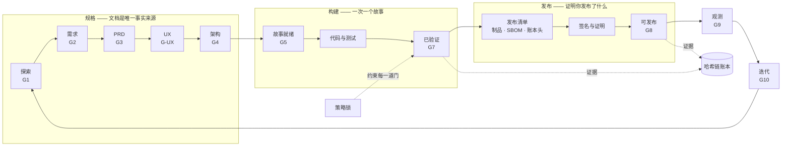

<div align="center">

# EOS —— 工程操作系统（Engineering Operating System）

**为 AI 协作团队打造的证据门控交付体系 —— 离线优先、零依赖，从想法一路走到签名发布。**

[](https://github.com/niaodian/eos/releases/latest)
[](https://github.com/niaodian/eos/actions/workflows/eos-ci.yml)
[](.github/workflows/eos-ci.yml)
[](https://github.com/niaodian/eos/attestations)
[](package.json)
[](package.json)
[](LICENSE)

[English](README.md) · 简体中文（与英文版同步维护 · 英文为参照语言，如有歧义以英文为准）

</div>

AI 助手写代码的速度，已经远超任何团队的评审能力。EOS 让这份速度保持诚实：交付的每个阶段 ——
问题、需求、设计、架构、故事、代码、发布 —— 都要通过一道机器校验的门；每个结论都绑定到它所评判的
那个确切提交；每次发布都能证明自己包含什么、在哪里构建。它完全运行在你的机器上：在 VS Code +
GitHub Copilot 里用，或在任意终端里用，不需要服务、不需要账号，也没有任何依赖。

## 为什么需要 EOS

| 问题 | EOS 的应对 |
|---|---|
| **AI 代码垃圾（AI code slop）** —— 看似合理、却没有规格也没有测试的代码，因为"看起来没问题"就被合并 | 工作只凭证据前进。门会在该提交上执行你真实的测试命令，并连同每个输入的哈希一起记录结论。缺失或过期的证据会被拒绝；工具缺失是 BLOCKED，工具崩溃是 ERROR —— 永远不会是 PASS。 |
| **看不见的治理退化** —— 某道门被悄悄放宽，某个提示词引用了一条早已不存在的规则 | 策略是锁定的：放宽任何一道门都需要书面理由和第二个人，否则 CI 失败。你的 AI 读到的提示词和 Agent，只能引用真实存在的门、命令和状态迁移。 |
| **供应链篡改** —— 发布出去的东西，并不是评审过的那个 | 发布清单（release manifest）绑定制品、SBOM 和账本头。它可以用 Ed25519 签名，并与 GitHub 制品证明（artifact attestation）或 SLSA 来源证明绑定，二者都在离线状态下验证。 |

一个引擎，两条轨道：初创团队拿到零摩擦的默认值，受监管团队把同样的检查变成硬性要求。不用分叉、
不用第二套工具，团队成长时也不需要迁移。

## 与众不同之处

- **天生离线优先。** EOS 核心从不访问网络：每个检查、每道门、每次验证都只靠本地的 Node 运行。
  对外的通道只有两条，而且都是显式、可选的 —— `eos policy sync` 拉取中心基线；你声明的 provider
  通过你自己的 `gh` 登录去问 GitHub 那些笔记本电脑无从知晓的事。这条边界由测试强制保证。
- **防篡改账本。** 每次晋级都是一条只追加、哈希链接的事件，跨分支、跨合并依然成立。
  `eos ledger --verify` 证明没有任何记录被改写。
- **策略锁。** `.eos/policy.lock.json` 锁定每一道门和每一条工作流规则。没有附理由、未经批准的放宽
  会让 CI 失败；组织还可以分发一份签名基线，由每个仓库在本地强制执行。
- **杜绝提示词与门禁漂移。** 你的 AI 所遵循的指令会与机器策略逐一核对，提示词永远无法承诺一道
  不存在的门、命令或状态迁移。
- **可审计的证据。** 每个结论都记录提交、门的版本和输入哈希。`eos report` 把账本变成一份治理报告，
  可以针对单个仓库，也可以覆盖整个组织。
- **任意技术栈，两种范式。** Node、Python、Go、Java、Rust、.NET；确定性的 SaaS 与概率性的
  LLM / Agent 产品（以评测驱动门禁）—— 二者显式隔离。

## 两条轨道，一个引擎

|  | **Standard**（默认） | **Regulated** |
|---|---|---|
| 适用于 | 开源项目、初创团队、内部产品 | 金融、医疗、公共部门、需要审计的软件 |
| 如何选择 | `eos init <pack>` | `eos init <pack> --track regulated` |
| 接入成本 | 零 —— 无密钥、无机密、无服务 | 一把发布签名密钥 + 由 CI 产出的证据 |
| 门禁与证据 | 全部 SDLC 门；证据可在本地记录 | 同样的门；发布证据必须来自 CI |
| 签名的发布清单 | 存在时验证，从不强制 | 必需 —— 未签名或被篡改会阻断发布 |
| 构建来源证明 | GitHub 制品证明，存在时验证 | 每个制品都必需；SLSA Build Level 3 生成器 |
| 放宽一道门 | 需要书面理由和第二个人 | 同左，另可叠加中心基线（`eos policy sync`） |
| 发布时缺少签名 | NOT_APPLICABLE，并给出补上它的命令 | FAIL —— 发布被阻断 |

日后切换只需一条命令。降回 Standard 本身就是一次策略放宽，所以 `eos next` 会直接指出它，并给出
确认它所需的确切命令 `eos policy lock --write --reason "<why>"`。

## 快速开始

你需要 Node.js 20.10+ 和 Git。VS Code + GitHub Copilot 是可选的 —— CLI 在任何终端里都能用。

```bash
# 1. 从一个固定的发布版本开始，并把它变成你的仓库
npx degit niaodian/eos#eos-2.0.0 my-app && cd my-app && git init

# 2. 声明项目 —— 还没有代码，技术栈留到架构阶段再定
npx --offline eos init config-only --write        # 想走严格轨道就加上 --track regulated

# 3. 询问唯一的下一步：做什么、为什么、怎么开始
npx --offline eos next

# 4. 日常循环
npx --offline eos status                          # 工作进展到哪里、处在哪条轨道
npx --offline eos check --gate discovery-ready    # 运行一道门并记录它的证据
npx --offline eos verify                          # 重跑你的改动可能影响到的每一道门
```

- **`npx --offline eos` 这个快捷方式需要 npm 10.9+**（Node 22 自带）。更老的 npm 请用
  `npm run -s eos -- <command>` 或 `node .github/eos/eos.mjs <command>` —— 三者完全等价。务必保留
  `--offline`：公共 npm 仓库里有一个同名但毫不相干的 `eos` 包，这个参数保证只运行当前检出的代码。
- **已经有代码了？** `npx --offline eos init` 会列出所有起步包（`node-service`、`python-service`、
  `go-service`、`java-service`、`rag-app`、`agentic-app`、`data-pipeline`、`library`、
  `regulated-app`），并指出与它所发现的代码相匹配的那些。
- **在 Copilot Chat 里**，同样的循环就是 **eos-guide** Agent，或 `/eos-next` · `/eos-resume` ·
  `/eos-status`。请把项目文件夹本身作为工作区根目录打开，否则这些 Agent 不会生效。

## 工作原理



- **门** —— 每个阶段都有一道（`eos explain <gate>` 打印它的规则）。门会运行真实的检查 —— 你的测试
  命令、规格对齐、Schema —— 并写下绑定到提交、门版本和每个输入哈希的证据。
- **状态迁移** —— `eos transition` 会拒绝非法跳转、缺失的批准和过期的证据；批准必须来自第二个人，
  而不是请求者本人。
- **账本** —— 每次晋级都是只追加、哈希链接的日志中的一条事件，可以跨分支干净地合并。
- **发布** —— `eos release bind` 把制品、SBOM 和账本头固定进发布清单；`eos release sign` 为它签名；
  CI 为构建出具证明；`eos verify-release` 在候选提交上把这一切全部核验一遍。

## 命令一览

| 命令 | 作用 |
|---|---|
| `eos next` | 唯一推荐的下一步 —— 做什么、为什么、怎么开始 |
| `eos status` | 产品、当前故事和发布进展到哪里，以及所在的治理轨道 |
| `eos check --gate <id>` | 真实运行一道门并记录它的证据 |
| `eos verify` | 重跑你的改动可能影响到的门（`--full` 运行全部） |
| `eos transition` · `eos approve` | 推进工作 —— 没有证据或第二位批准者就会被拒绝 |
| `eos release bind` · `sign` · `verify` | 绑定制品、SBOM 和账本头；签名；验证签名与来源证明 |
| `eos verify-release --release <id>` | 发布门，在候选提交上重新运行 |
| `eos policy check` · `lock` · `sync` | 发现、批准并分发治理变更 |
| `eos report --format markdown` | 治理报告：门、豁免、证据、SBOM 与签名 |
| `eos health` · `eos doctor` | 一屏看清项目健康度；检查 EOS 自身是否接线正确 |

加上 `--json` 即可得到机器可读的输出；退出码与诊断遵循同一份成文契约：
[docs/zh/developer-experience.md](docs/zh/developer-experience.md)。

## 验证一个 EOS 发布

EOS 的发布在 GitHub Actions 中构建并出具证明 —— 正是 EOS 要求你的发布所采用的方式。采用之前，
你可以亲自核验：

```bash
gh release download eos-2.0.0 --repo niaodian/eos --pattern 'eos-2.0.0.tar.gz'
gh attestation verify eos-2.0.0.tar.gz --repo niaodian/eos
```

每个发布还附带它的 SBOM 和一个 `SHA256SUMS` 文件。

## 仓库里有什么

```
.eos/               策略（门、工作流、Agent 映射）、你的项目声明、Schema、
                    证据、豁免、账本、策略锁和发布清单
.github/eos/        CLI 及其确定性引擎（零依赖），以及它的测试
.github/hooks/      校验器与护栏：配置、文档对齐、机密扫描、产品质量门
.github/agents/     eos-guide 以及各阶段的编排 Agent（供 Copilot Chat 使用）
.github/prompts/    斜杠命令工作流；.github/instructions/ 存放按范围生效的编码规则
.github/workflows/  eos-ci.yml（Linux、macOS、Windows）与 eos-release.yml（带证明的发布）
docs/               你的规格与 ADR；docs/eos/ 是 EOS 手册（中文版在 docs/zh/）
```

## 文档

- [快速开始](docs/zh/quickstart.md) —— 前置条件与你的第一天。
- [用户手册](docs/zh/user-manual.md) —— 从想法到上线再到迭代，含分步的 SaaS 与 Agentic 路线。
- [升级到 eos-2.0.0](docs/zh/user-manual.md#105-从-eos-122x-升级到-eos-200) —— 改变了什么、你需要做什么。
- [工作流契约](docs/zh/developer-experience.md) —— CLI、退出码、JSON 与诊断。
- [技术栈预设与轨道](docs/zh/stack-presets.md) —— 所有受支持的技术栈，以及如何选择轨道。
- [设计原理](docs/zh/blueprint.md) 与 [架构决策记录](docs/adr/)。

## 环境要求与说明

- **Node.js 20.10+ 和 Git** —— 别无其他。CI 在 Linux、macOS 和 Windows 上运行 Node 20 与 22。
- **VS Code + GitHub Copilot 是可选的。** 只有当项目文件夹本身是工作区根目录时，Agent、提示词和
  hook 才会加载。hook 是 VS Code 的预览特性。
- **一次性加固。** 真正的仓库建好后，在 Copilot Chat 中运行 `/eos-init`：分支保护、CODEOWNERS 与
  审批，进度记录在 [docs/zh/activation.md](docs/zh/activation.md)。
- **本地 CI。** `act push` 在 Docker 中运行 [eos-ci.yml](.github/workflows/eos-ci.yml)；没有 Docker 时，
  `npm run verify` 会运行核心检查。
- **BMAD。** 安装了 `bmad-*` 技能时，EOS 会编排它们完成探索、PRD、架构与故事拆分；参见
  [docs/zh/agent-map.md](docs/zh/agent-map.md)。

## 许可证

[MIT](LICENSE) © 2026 Xavier Zhang.
