<!-- GENERATED FILE — DO NOT EDIT.
     Source of truth: .eos/gates.json + lib/state.mjs gateInputs()
     Regenerate:      node .github/eos/eos.mjs docs --write
     CI check:        node .github/eos/eos.mjs docs --check

     Editing this file by hand is pointless: the next --write overwrites it, and --check fails
     the build in the meantime. Change the policy instead; the prose follows. -->

# Evidence dependency graph

An edge means: editing that file makes this gate's recorded evidence STALE. Drawn from the same `gateInputs()` the engine uses to decide staleness, so the diagram cannot disagree with the behaviour.

```mermaid
graph LR
  G_activation["G0 activation"]
  F__eos_project_json([".eos/project.json"])
  F__eos_project_json --> G_activation
  F_docs_eos_activation_md(["docs/eos/activation.md"])
  F_docs_eos_activation_md --> G_activation
  G_discovery_ready["G1 discovery-ready"]
  F__eos_project_json --> G_discovery_ready
  F_docs_discovery_md(["docs/discovery.md"])
  F_docs_discovery_md --> G_discovery_ready
  F_docs_discovery_json(["docs/discovery.json"])
  F_docs_discovery_json --> G_discovery_ready
  G_requirements_ready["G2 requirements-ready"]
  F__eos_project_json --> G_requirements_ready
  F_docs_requirements_md(["docs/requirements.md"])
  F_docs_requirements_md --> G_requirements_ready
  F_docs_requirements_json(["docs/requirements.json"])
  F_docs_requirements_json --> G_requirements_ready
  G_prd_ready["G3 prd-ready"]
  F__eos_project_json --> G_prd_ready
  F_docs_prd_md(["docs/prd.md"])
  F_docs_prd_md --> G_prd_ready
  G_ux_ready["G-UX ux-ready"]
  F__eos_project_json --> G_ux_ready
  F_docs_design_json(["docs/design.json"])
  F_docs_design_json --> G_ux_ready
  F_docs_DESIGN_md(["docs/DESIGN.md"])
  F_docs_DESIGN_md --> G_ux_ready
  F_docs_EXPERIENCE_md(["docs/EXPERIENCE.md"])
  F_docs_EXPERIENCE_md --> G_ux_ready
  G_architecture_ready["G4 architecture-ready"]
  F__eos_project_json --> G_architecture_ready
  F_docs_architecture_md(["docs/architecture.md"])
  F_docs_architecture_md --> G_architecture_ready
  F_docs_architecture_json(["docs/architecture.json"])
  F_docs_architecture_json --> G_architecture_ready
  F_docs_requirements_json --> G_architecture_ready
  G_story_ready["G5 story-ready"]
  F__eos_project_json --> G_story_ready
  G_verified["G7 verified"]
  F__eos_project_json --> G_verified
  F_docs_trace_matrix_md(["docs/trace-matrix.md"])
  F_docs_trace_matrix_md --> G_verified
  F_docs_evidence_test_run_json(["docs/evidence/test-run.json"])
  F_docs_evidence_test_run_json --> G_verified
  F_docs_evidence_eval_summary_json(["docs/evidence/eval-summary.json"])
  F_docs_evidence_eval_summary_json --> G_verified
  G_release_ready["G8 release-ready"]
  F__eos_project_json --> G_release_ready
  F_docs_prd_md --> G_release_ready
  F_docs_trace_matrix_md --> G_release_ready
  F_docs_evidence_nfr_summary_json(["docs/evidence/nfr-summary.json"])
  F_docs_evidence_nfr_summary_json --> G_release_ready
  F_docs_evidence_test_run_json --> G_release_ready
  F__eos_releases_RELEASE_EXAMPLE_json([".eos/releases/RELEASE-EXAMPLE.json"])
  F__eos_releases_RELEASE_EXAMPLE_json --> G_release_ready
  G_telemetry_ready["G9 telemetry-ready"]
  F__eos_project_json --> G_telemetry_ready
  F_docs_telemetry_json(["docs/telemetry.json"])
  F_docs_telemetry_json --> G_telemetry_ready
  F_docs_telemetry_plan_md(["docs/telemetry-plan.md"])
  F_docs_telemetry_plan_md --> G_telemetry_ready
  F_docs_discovery_json --> G_telemetry_ready
  G_iteration_ready["G10 iteration-ready"]
  F__eos_project_json --> G_iteration_ready
  F_docs_iteration_json(["docs/iteration.json"])
  F_docs_iteration_json --> G_iteration_ready
  F_docs_telemetry_json --> G_iteration_ready
```

> Governance files (`.eos/gates.json`, `.eos/workflow.json`) are bound to EVERY gate and are left out of the diagram — an edge from each of them to each gate would say less, not more. Changing either invalidates all recorded evidence by design.
