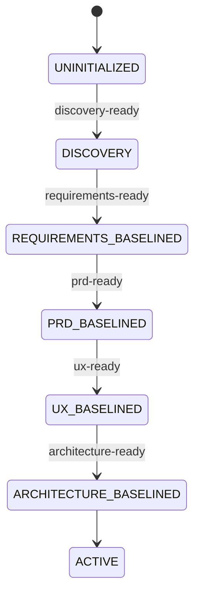
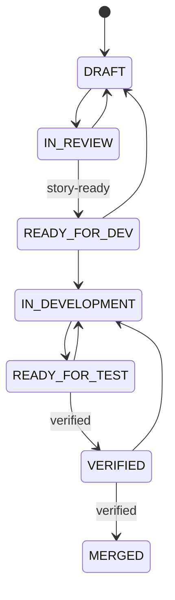
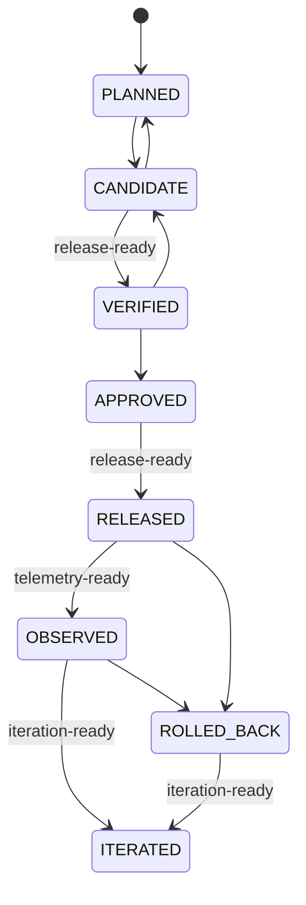

<!-- GENERATED FILE — DO NOT EDIT.
     Source of truth: .eos/workflow.json
     Regenerate:      node .github/eos/eos.mjs docs --write
     CI check:        node .github/eos/eos.mjs docs --check

     Editing this file by hand is pointless: the next --write overwrites it, and --check fails
     the build in the meantime. Change the policy instead; the prose follows. -->

# Workflow

Profiles: `standard-product` · `prototype` · `controlled` · `regulated`. Default: `standard-product`.

## State machines

### `product`

### `story`

### `release`

## Gate policy by profile and change type

Each cell is what the profile requires of that gate for that kind of change. `required` must pass, `waivable` can be lifted by an approved unexpired waiver, `not_applicable` is recorded as a decision rather than skipped.

### `standard-product`

Full SDLC profile: a product baseline plus per-story feature work, with release verification.

| Change type | `activation` | `discovery-ready` | `requirements-ready` | `prd-ready` | `ux-ready` | `architecture-ready` | `story-ready` | `verified` | `release-ready` | `telemetry-ready` | `iteration-ready` |
|---|---|---|---|---|---|---|---|---|---|---|---|
| `PRODUCT_BASELINE` | **required** | **required** | **required** | **required** | **required** | **required** | – | – | – | – | – |
| `FEATURE` | **required** | – | – | **required** | – | – | **required** | **required** | – | – | – |
| `BUGFIX` | **required** | – | – | – | – | – | **required** | **required** | – | – | – |
| `SPIKE` | **required** | – | – | – | – | – | – | – | – | – | – |
| `HOTFIX` | **required** | – | – | – | – | – | waivable | **required** | – | – | – |
| `DOC_ONLY` | – | – | – | – | – | – | – | – | – | – | – |
| `GOVERNANCE` | **required** | – | – | – | – | – | – | – | – | – | – |
| `RELEASE` | **required** | – | – | – | – | – | – | – | **required** | **required** | **required** |

### `prototype`

Exploration-only profile: nothing is gated except local activation. Never use it for a product that ships.

| Change type | `activation` | `discovery-ready` | `requirements-ready` | `prd-ready` | `ux-ready` | `architecture-ready` | `story-ready` | `verified` | `release-ready` | `telemetry-ready` | `iteration-ready` |
|---|---|---|---|---|---|---|---|---|---|---|---|
| `SPIKE` | **required** | – | – | – | – | – | – | – | – | – | – |
| `DOC_ONLY` | – | – | – | – | – | – | – | – | – | – | – |

### `controlled`

Enterprise and business-critical systems. Everything Standard requires, plus: no gate may be waived, release verification applies to hotfixes too, and telemetry must be planned before a release is considered done. Use when an outage has customers, money or a regulator attached.

| Change type | `activation` | `discovery-ready` | `requirements-ready` | `prd-ready` | `ux-ready` | `architecture-ready` | `story-ready` | `verified` | `release-ready` | `telemetry-ready` | `iteration-ready` |
|---|---|---|---|---|---|---|---|---|---|---|---|
| `PRODUCT_BASELINE` | **required** | **required** | **required** | **required** | **required** | **required** | – | – | – | – | – |
| `FEATURE` | **required** | – | – | **required** | – | – | **required** | **required** | – | – | – |
| `BUGFIX` | **required** | – | – | – | – | – | **required** | **required** | – | – | – |
| `SPIKE` | **required** | – | – | – | – | – | – | – | – | – | – |
| `HOTFIX` | **required** | – | – | – | – | – | **required** | **required** | **required** | – | – |
| `DOC_ONLY` | – | – | – | – | – | – | – | – | – | – | – |
| `GOVERNANCE` | **required** | – | – | – | – | – | – | – | – | – | – |
| `RELEASE` | **required** | – | – | – | – | – | – | – | **required** | **required** | **required** |

### `regulated`

Compliance and audit-sensitive systems (HIPAA / PCI-DSS / SOC2 / SOX / GDPR and friends). Everything Controlled requires, plus: every change is classified with a recorded reason, a spike may not be merged, the iteration write-back is required so the loop is closed in the record, and DOC_ONLY no longer switches the activation gate off — in an audited environment "it was only documentation" is a claim that still has to be verifiable.

| Change type | `activation` | `discovery-ready` | `requirements-ready` | `prd-ready` | `ux-ready` | `architecture-ready` | `story-ready` | `verified` | `release-ready` | `telemetry-ready` | `iteration-ready` |
|---|---|---|---|---|---|---|---|---|---|---|---|
| `PRODUCT_BASELINE` | **required** | **required** | **required** | **required** | **required** | **required** | – | – | – | – | – |
| `FEATURE` | **required** | – | – | **required** | – | – | **required** | **required** | – | – | – |
| `BUGFIX` | **required** | – | – | – | – | – | **required** | **required** | – | – | – |
| `SPIKE` | **required** | – | – | – | – | – | – | – | – | – | – |
| `HOTFIX` | **required** | – | – | – | – | – | **required** | **required** | **required** | – | – |
| `DOC_ONLY` | **required** | – | – | – | – | – | – | – | – | – | – |
| `GOVERNANCE` | **required** | – | – | – | – | – | – | – | – | – | – |
| `RELEASE` | **required** | – | – | – | – | – | – | – | **required** | **required** | **required** |
